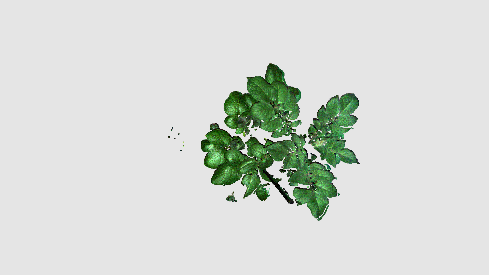

# **Initial large 3D data exploration**
Pointclouds are fascinating data files, and tools like CloudCompare can provide powerful insights—even enabling batch analysis.
However, running these tools on compute platforms such as Kubernetes remains challenging.
This project was created as a lightweight alternative, offering lower computation costs and more flexibility.
The `plyfile` package is used to load the pointclouds, which are then analysed using `open3d`.

## Example Analysis Scripts
- **topview.py** – generates top-view images of pointclouds
<p align="center">
	
	
</p>

- **pointcloud_analysis.py** – provides basic analyses such as NDVI calculation and triangular mesh area estimation

## Testdata
The test data consists of scans from a Phenospex F500 camera.
These scans store 16-bit color and NIR information in scalar fields named `vwl1–4`.

Since the dataset is fairly large (~30 MB), it is stored in Git Large File Storage (LFS) to keep the repository lightweight.
Before cloning the repository, make sure to enable LFS by running:
```git lfs install```.

## Adjust rendering options
Rendering options for images are stored in the JSON file: *render_parameters.json*.
To modify settings such as background color, open this file and update the corresponding parameters.
